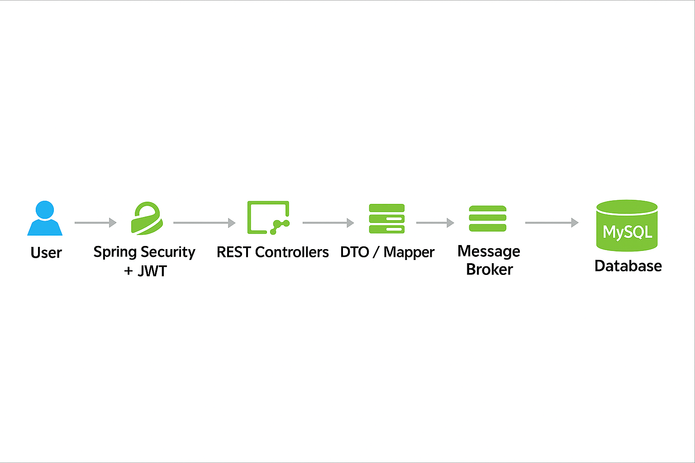
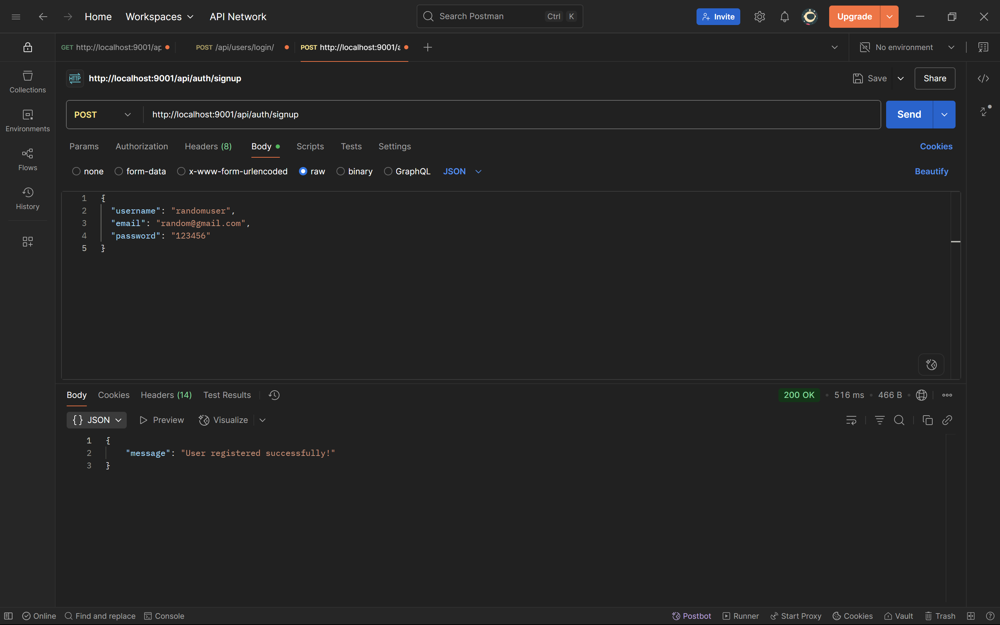
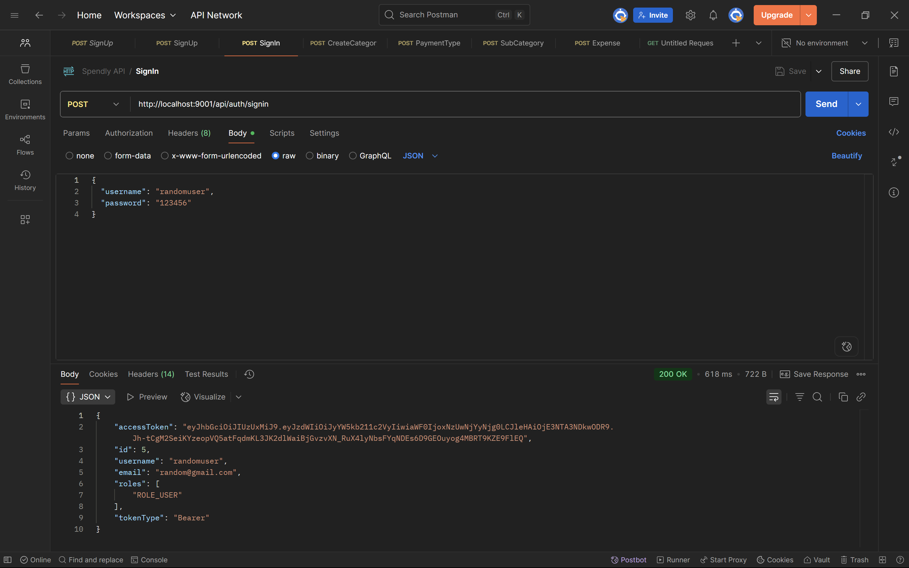
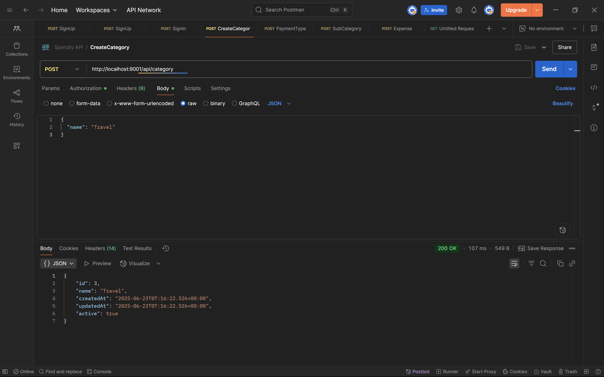
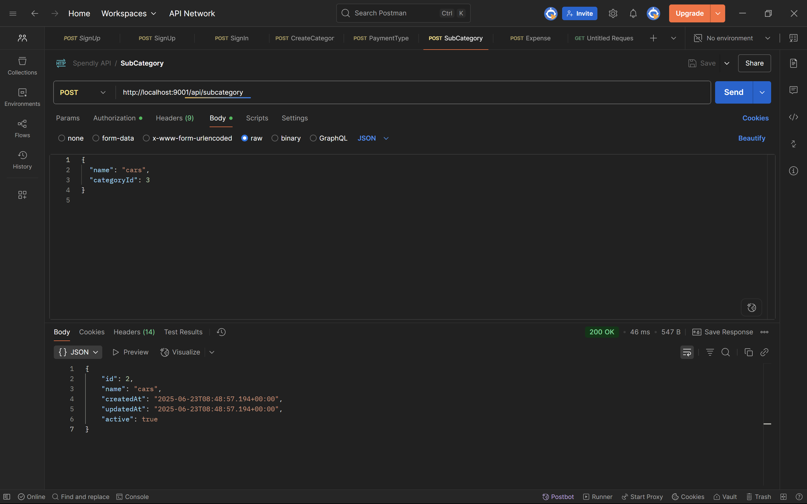
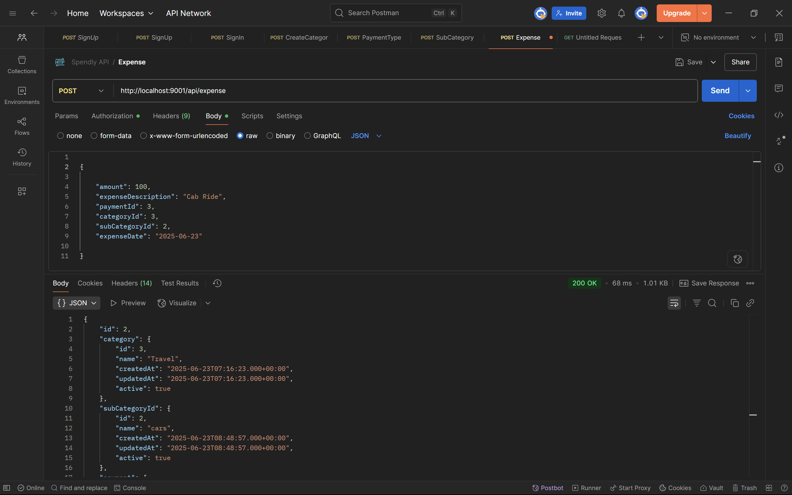

# SpendBuddy 💸 - Personal Expense Tracker Backend

A secure and extensible RESTful backend built with Spring Boot to manage personal finances, categorized expenses, and payment tracking.

---

## 📜 Solution Overview

SpendBuddy is a multi-user expense tracking platform with JWT-secured APIs for managing categories, subcategories, payment modes, and expenses. It enforces strict per-user data isolation and supports full CRUD operations with flexible filtering options (by date, category, and month).

It’s designed with modular services, secure authentication, and expandable roles like USER, MODERATOR, and ADMIN.

---

## 🧬 Architecture Diagram




## 🧰 Services & Major Components

### Auth Service

- `/api/auth/signup` – Register new user
- `/api/auth/signin` – Authenticate and receive JWT

### Expense Management

- `/api/expense` – Add, filter, and list expenses
- Filter by:
  - Date range
  - Category
  - Current month

### Category & SubCategory Services

- `/api/category` – Manage expense categories
- `/api/subcategory` – Manage nested classifications under categories
  - Each subcategory must reference a `categoryId`.
  - Example:
    ```json
    {
      "name": "cars",
      "categoryId": 3
    }
    ```

### Payment Type

- `/api/paymenttype` – Define & update payment modes

### Security & Role Management

- JWT-based authentication
- Roles supported: `ROLE_USER`, `ROLE_MODERATOR`, `ROLE_ADMIN`
- Each user has isolated access

---

## 🛠️ Tech Stack

- Java 17+
- Spring Boot 3.5.x
- Spring Security + JWT
- Spring Data JPA + Hibernate
- MySQL Database
- Maven
- Lombok

---

## 🚀 Getting Started

### 🔧 Prerequisites

- Java 17 or newer
- Maven 3.6+
- MySQL 8+
- Postman

### ⚙️ Setup Instructions

1. Clone the repo:

   ```bash
   git clone https://github.com/balaji-matta18/spendbuddy-api.git
   cd spendbuddy-api
   ```

2. Create a MySQL database:

   ```sql
   CREATE DATABASE spendbuddy_db;
   ```

3. Set your `application.properties`:

   ```properties
   spring.datasource.url=jdbc:mysql://localhost:3306/spendbuddy_db
   spring.datasource.username=your_username
   spring.datasource.password=your_password

   app.jwtSecret=your_jwt_secret
   app.jwtExpirationMs=86400000
   ```

4. Run the app:

   ```bash
   mvn spring-boot:run
   ```

5. Insert default roles:

   ```sql
   INSERT INTO roles(name) VALUES('ROLE_USER'), ('ROLE_MODERATOR'), ('ROLE_ADMIN');
   ```

---

## 🥮️ Testing with Postman

You can test all endpoints using Postman.

### 🛍️ Accessing API Endpoints

#### 📧 Signup

- **Method:** POST
- **Endpoint:** `http://localhost:9001/api/auth/signup`
- **Body:**
  ```json
  {
    "username": "randomuser",
    "email": "random@gmail.com",
    "password": "123456"
  }
  ```


#### 🔐 Login

- **Method:** POST
- **Endpoint:** `http://localhost:9001/api/auth/signin`
- **Body:**
  ```json
  {
    "username": "randomuser",
    "password": "123456"
  }
  ```


#### ➕ Create Category

- **Method:** POST
- **Endpoint:** `http://localhost:9001/api/category`
- **Authorization:** Bearer Token
- **Body:**
  ```json
  {
    "name": "Travel"
  }
  ```


#### 🔹 Create SubCategory

- **Method:** POST
- **Endpoint:** `http://localhost:9001/api/subcategory`
- **Authorization:** Bearer Token
- **Body:**
  ```json
  {
    "name": "cars",
    "categoryId": 3
  }
  ```


#### 💳 Create Payment Type

- **Method:** POST
- **Endpoint:** `http://localhost:9001/api/paymenttype`
- **Authorization:** Bearer Token
- **Body:**
  ```json
  {
    "type": "UPI"
  }
  ```


#### 📊 Add Expense

- **Method:** POST
- **Endpoint:** `http://localhost:9001/api/expense`
- **Authorization:** Bearer Token
- **Body:**
  ```json
  {
     "amount": 100,
    "expenseDescription": "Cab Ride",
    "paymentId": 3,
    "categoryId": 3,
    "subCategoryId": 2,
    "expenseDate": "2025-06-23"
  }
  ```


---

> ## 📬 Postman Collection

You can import all SpendBuddy API requests directly into Postman:

📁 [Download SpendBuddy Postman Collection](Docs/Postman/SpendBuddy API.postman_collection.json)

1. Open Postman
2. Click **Import**
3. Select the downloaded JSON file
4. The collection `SpendBuddy API` will appear in your sidebar


---

